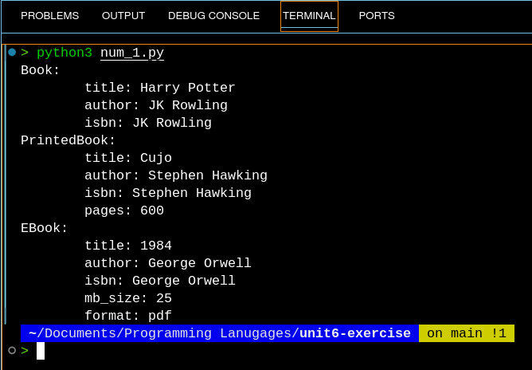
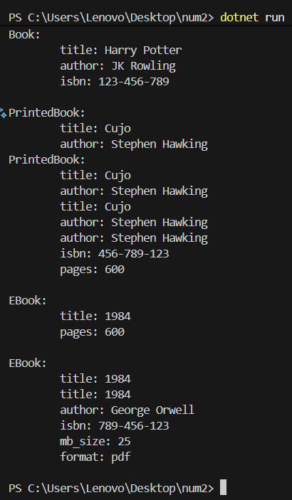

# CCS 238 - UNIT 6 Exercise

This repository contains the source code for the unit 6 exercise of CCS 238 - Programming Languages.

Submitted by: **Carado** & **Tacuel**

## Number 1:

Using your preferred programming language, create a simple program that will do the following:

- (10 points) Create a base/parent class called `Book` with class attributes like `title`, `author`, `ISBN`, and a method `getDetails()` that returns book information.

- (20 points) Create two derived classes:
	- `PrintedBook` (with an additional attribute such as number of pages)
	- `EBook` (with attributes such as file format and file)
	- Each derived class should override `getDetails()` to include its specific information.

- (20 points) Apply proper encapsulation (getter/setter methods, public/private modifiers)

- Create an array containing 1 `Book`, 1 `PrintedBook`, and 1 `EBook`. Then create a loop that will call each instance’s `getDetails()` method. Attach a screenshot of the console output.



## Number 2: Using C#

Converted the Python source code from Number 1 into **C#**.

- Demonstrates inheritance, encapsulation, and method overriding.
- Tested via `.NET SDK` using `dotnet run`.

### How to run:
1. Open terminal, input:
```bash
dotnet new console -n num2
cd num2
```
2. Replace auto-generated Program.cs with num_2.cs content
3. Same terminal, input:
```bash
dotnet run
```
